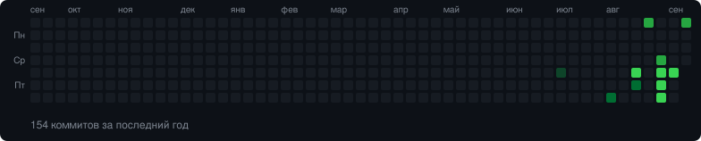

# Привет! Я HVHBIGNAME 👋

**Разработчик, создающий полезные инструменты и изучающий новые технологии.**

---

## Обо мне

- 🚀 Превращаю идеи в работающие проекты
- 🧠 Постоянно изучаю новые технологии
- 🛠️ Люблю сложные задачи, отладку и автоматизацию
- 🤝 Открыт к интересным проектам и сотрудничеству

## Технологии

## Мои проекты

<!-- PROJECTS:START -->
- **[BCore](https://github.com/HVHBIGNAME/BCore)** — Native Rust Minecraft server (26.2 / protocol 776) — vanilla parity, native plugin system, Bukkit/Spigot/Paper bridge
  `Rust` · ⭐ 0 · обновлён сегодня
- **[server-cleaner](https://github.com/HVHBIGNAME/server-cleaner)** — Linux server logs and history cleaner script
  `Shell` · ⭐ 0 · обновлён 11 дн. назад
- **[anti-monitoring](https://github.com/HVHBIGNAME/anti-monitoring)** — Remove hosting provider monitoring agents (QEMU GA, Cloud-Init, VMware Tools, AWS/GCP/Azure agents) to disable remote...
  `Shell` · ⭐ 0 · обновлён 11 дн. назад
<!-- PROJECTS:END -->

## Активность GitHub

---

⭐ **Спасибо, что заглянули в мой профиль!**
