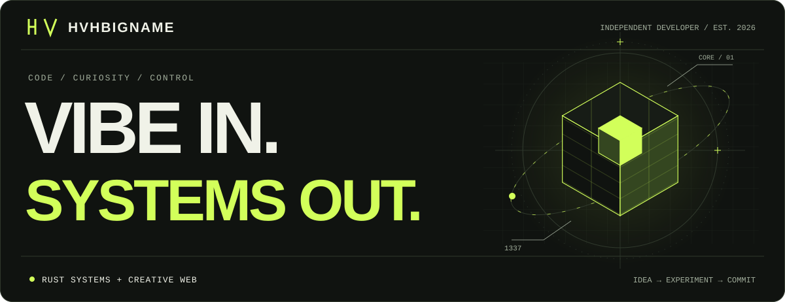
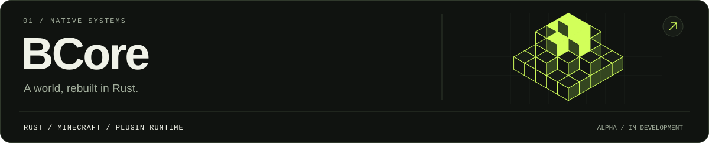
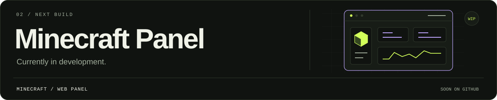
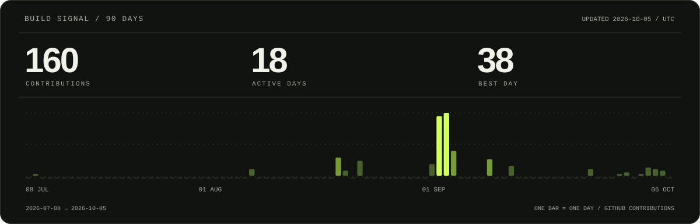
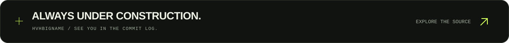

<picture>
  <source media="(prefers-color-scheme: light)" srcset="./assets/hero-light.svg">
  
</picture>

  <a href="#selected-builds">Проекты</a> &nbsp; / &nbsp;
  <a href="#working-set">Стек</a> &nbsp; / &nbsp;
  <a href="#build-signal">Активность</a> &nbsp; / &nbsp;
  <a href="https://github.com/HVHBIGNAME?tab=repositories">Все репозитории ↗</a>

### Вайбкодер1337 / HVHBIGNAME

Собираю игровые серверы, инструменты и веб-интерфейсы.
Сейчас в фокусе — **BCore** на Rust и новая **Minecraft-панель**, которую скоро опубликую на GitHub.

## Selected builds

<a href="https://github.com/HVHBIGNAME/BCore">
  <picture>
    <source media="(prefers-color-scheme: light)" srcset="./assets/bcore-light.svg">
    
  </picture>
</a>

**[BCore](https://github.com/HVHBIGNAME/BCore)** — собственная реализация Minecraft Java-сервера на Rust:
сетевой протокол, генерация мира, нативные плагины и JVM-мост для Bukkit / Spigot / Paper.
Сейчас в **alpha**; совместимость с vanilla постепенно расширяется.

[Исходники ↗](https://github.com/HVHBIGNAME/BCore) · [Трекер реализации ↗](https://hvhbigname.github.io/BCore/)

 

<picture>
  <source media="(prefers-color-scheme: light)" srcset="./assets/minecraft-panel-light.svg">
  
</picture>

**Minecraft-панель** — новый проект в разработке. Скоро опубликую на GitHub.

## Working set

- **Ближе к системе** &nbsp; `Rust` `Java` `Python` `Shell`
- **Ближе к экрану** &nbsp; `JavaScript` `HTML / CSS`
- **Ещё в арсенале** &nbsp; `Go` `Android` `Git` `GitHub Actions`

## Build signal

<picture>
  <source media="(prefers-color-scheme: light)" srcset="./assets/activity-graph-light.svg">
  
</picture>

Каждая колонка — один день. GitHub contributions включают коммиты, issues, pull requests и reviews.

Автообновление: <b>каждый час</b> через <a href="https://github.com/HVHBIGNAME/HVHBIGNAME/actions/workflows/update-profile.yml">GitHub Actions</a>. Возможны задержки планировщика GitHub.

<b>Открыть журнал публичных проектов</b>

<!-- PROJECTS:START -->
| Репозиторий | Язык | Последний push |
| :-- | :-- | :-- |
| [emberdeck](https://github.com/HVHBIGNAME/emberdeck) | Rust | 2026-10-02 |
| [SoftDownloader](https://github.com/HVHBIGNAME/SoftDownloader) | Rust | 2026-10-02 |
| [ios-build-ci](https://github.com/HVHBIGNAME/ios-build-ci) | — | 2026-10-02 |
| [BCore](https://github.com/HVHBIGNAME/BCore) | Rust | 2026-09-28 |
| [server-cleaner](https://github.com/HVHBIGNAME/server-cleaner) | Shell | 2026-08-23 |
<!-- PROJECTS:END -->

Последние push в публичные авторские репозитории. Даты — UTC.

 

<a href="https://github.com/HVHBIGNAME?tab=repositories">
  <picture>
    <source media="(prefers-color-scheme: light)" srcset="./assets/footer-light.svg">
    
  </picture>
</a>
